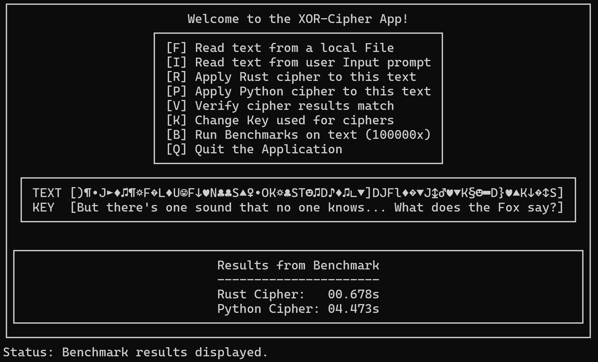

# XOR Cipher App



## Description

An application to apply and benchmark a simple XOR cipher in Python and Rust using the curses TUI.

**NOTE**: This application is designed and tested primarily on Unix-like systems and relies on the curses library for its terminal-based user interface. While it has been specifically developed and tested with WSL, it is expected to work on most Unix-like systems where the curses library is available.

## Usage

After launching the application, you'll encounter a menu with the following options:

- **`[F]` Read text from a local File**: Change the current text to the contents of a local text file. You will be prompted to enter the path to the file.
- **`[I]` Read text from user Input prompt**: Change the current text to a manually inputted text. You will be prompted to enter your text.
- **`[R]` Apply Rust cipher to this text**: Apply the XOR cipher implemented in Rust to update the input text.
- **`[P]` Apply Python cipher to this text**: Apply the XOR cipher implemented in Python to update the input text.
- **`[V]` Verify cipher results match**: Compare the results of the Rust and Python ciphers to verify that that they produce the same output for the given input text.
- **`[K]` Change Key used for ciphers**: Change the current key used by both the Rust and Python ciphers. You will be prompted to enter a new key.
- **`[B]` Run Benchmarks on text (100000x)**: Run benchmarks by performing the cipher operation 100k times on the Rust and Python implementations and display the time taken for each.
- **`[Q]` Quit the application**: Exit.

**NOTE**: You can exit any prompt by pressing `[ENTER]` with an empty input.

## Dependencies

- Python 3: Required for running the Python code.
- Rust and rustc: Required for compiling and running the Rust code.

## Installation

1. Clone the repository:
   ```bash
   git clone https://github.com/GiovanniCornejo/XORCipherApp.git
   cd XORCipherApp
   ```
2. Compile the Rust shared cipher library:
   ```bash
   make
   ```
3. Run the application:
   ```bash
   python3 main.py
   ```

## License

This project is licensed under the [MIT License](LICENSE).
